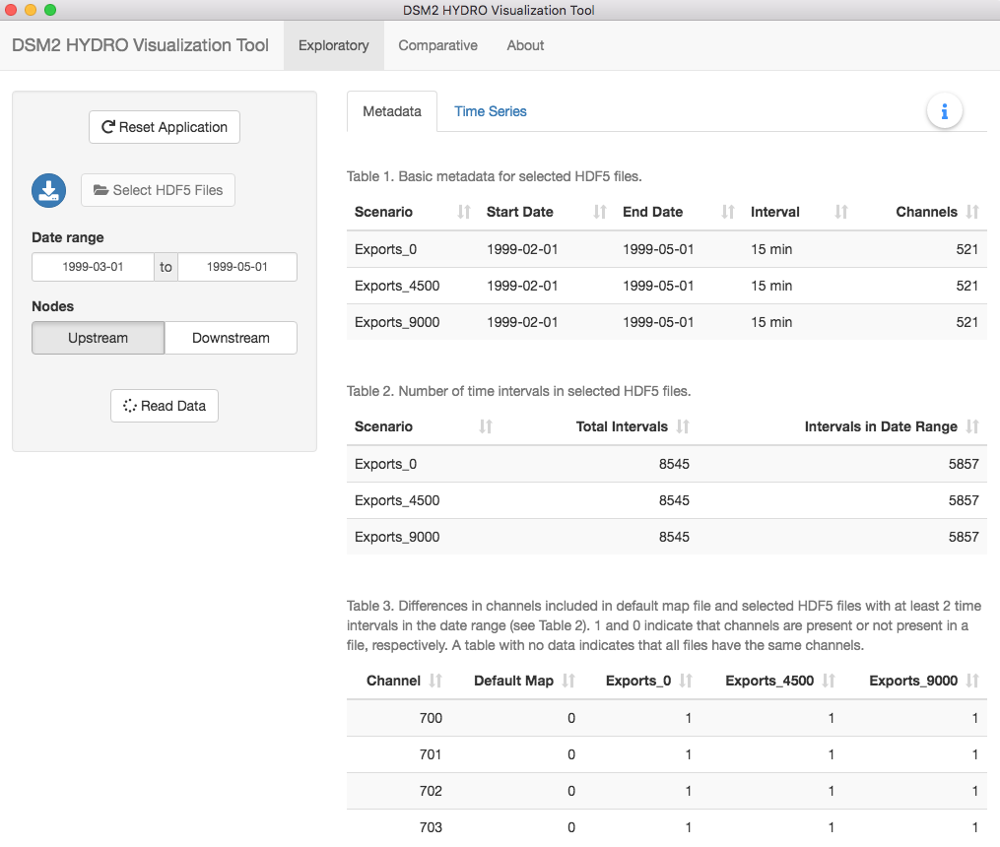
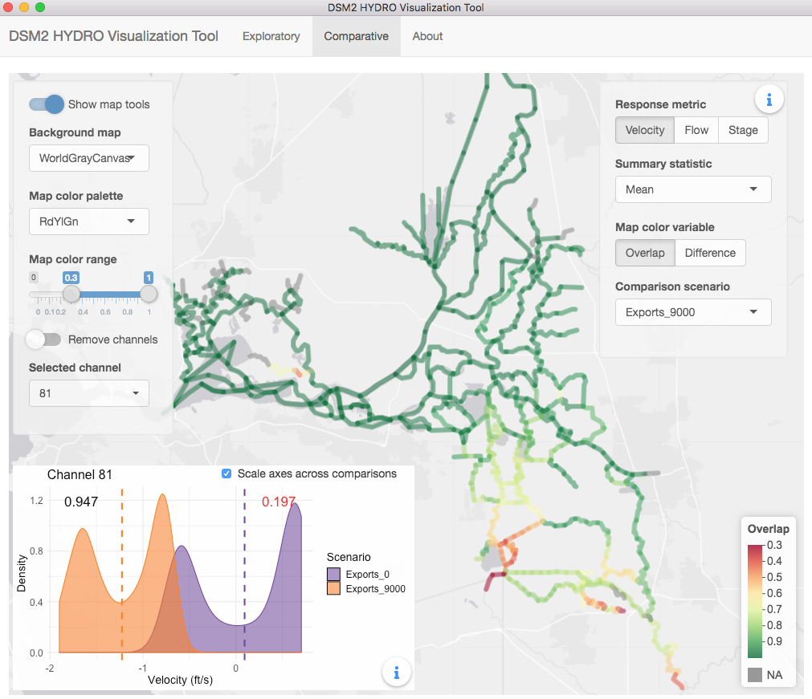

# DSM2 HYDRO Visualization Tool

A tool for visualizing [DSM2](http://baydeltaoffice.water.ca.gov/modeling/deltamodeling/models/dsm2/dsm2.cfm) HYDRO output (HDF5 files) based on the [Shiny](https://shiny.rstudio.com/) web framework for [R](https://www.r-project.org/) and distributed as a desktop application with [Electron](https://electronjs.org/) using the [R Shiny Electron template](https://github.com/dirkschumacher/r-shiny-electron).

Figure 1. Metadata tab of the Exploratory section of the DSM2 HYDRO Visualization Tool after selecting three example DSM2 output files that vary in total exports from the CVP and SWP export facilities. The example files are available for download via the blue button in the top left corner.

Figure 2. Time Series tab of the Exploratory section of the DSM2 HYDRO Visualization Tool after selecting and reading a subset of three example DSM2 output files that vary in total exports from the CVP and SWP export facilities. 

Figure 3. Color-scaled channel map of the comparative map analysis feature of the DSM2 HYDRO Visualization Tool for a subset of three example DSM2 output files that vary in total exports from the CVP and SWP export facilities.

### Installation

If you want to learn more about the DSM2 Viz Tool, you can install it and play around with the example files. If you just want a quick peek at the core ideas, then take a look at the [Delta Hydrodynamics app](https://fishsciences.shinyapps.io/delta-hydrodynamics/).

To install on Mac, download the [zip file](https://s3-us-west-2.amazonaws.com/datavore/DSM2-Viz-Tool/DSM2-Viz-Tool-darwin-x64-0.2.0.zip), unzip the file, and move the application to your preferred location. To uninstall, move the application to the trash.

To install on Windows, download and run the [setup file](https://s3-us-west-2.amazonaws.com/datavore/DSM2-Viz-Tool/DSM2-Viz-Tool-0.2.0+Setup.exe). When setup is complete, the application will launch automatically. The application can be uninstalled through the standard Windows uninstall procedures.

### Bug Reports and Feature Requests

The DSM2 Viz Tool has only been tested on a small number of DSM2 output files and only on Windows 10 and MacOS Mojave. Contact us with bug reports and feature requests by filing an issue.
